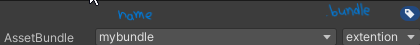
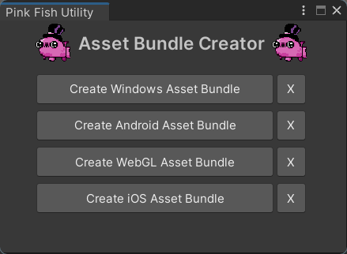

> 💡 (https://github.com/DreamFaver)
# 🎒 PinkFish AssetBundle Loader

**PinkFish AssetBundle Loader** is a Unity Editor extension that simplifies loading and unloading `.bundle` AssetBundles directly from the `StreamingAssets` directory — no runtime scripts or boilerplate needed.

---

## 📦 Features

- ✅ Load all AssetBundles from `StreamingAssets/AssetBundle/[Platform]`
- 📜 View all loaded asset names in the Inspector
- 🧹 Unload all bundles with a click
- 🧪 Editor-only execution (works without Play Mode)
- 🧩 Packaged for Unity Package Manager (via Git)

---

## 🧰 Installation (Unity Package Manager)

1. Go to: `Window → Package Manager`
2. Click the **+** → `Add package from Git URL...`
3. Paste:
4. if didn't worked which won't  :3
5. just download it manually and add it to your project.
---

## 🖼️ How to Use

### 🪟 Step 1: Open the AssetBundle Creator

At the top of the Unity Editor window:  
**PinkFish Utility → Assetbundle → Creator**

---

### 🧱 Step 2: Create Your Bundle

- Select any model or asset in the **Project tab**
- In the **Inspector**, set:
- Bundle name (e.g. `mybundle`)
- Extension name (e.g. `.meta`)
- ❗ Use **lowercase** names and **no spaces**

---

### 🛠️ Step 3: Manage Bundles by Platform

- Use the Editor window to **Create** or **Delete** bundles
- Platform-specific builds:
- ✅ Android / Windows / WebGL from any OS
- ⚠️ iOS requires **macOS** and Unity iOS module installed

---

## 🧩 Folder Structure
- _PinkFish_Utility
    - Asset Bundle Creator
    - Runtime
    - Editor
        - Resources
        - Scripts
